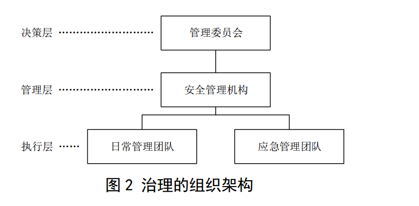

## 原文
- 条例谓词划分
    - `应`：强要求
    - `宜`：推荐采用
    - `可`：弱要求

## 评论以及分类标识
分析Fabric对于对应条例的支持，可分为以下情形
| 图标与图例 | 含义 |
|----|----|
|    |   Fabric目前的架构和实现很难满足该条例的要求，应予以注意 |
|    | 服务提供商需要通过额外的软件增值服务、业务逻辑、或少量修改Fabric源码，满足条例要求 |
|    | Fabric已经满足该条例要求 |
|      | 使用宽松谓词的条例，没有实施强制要求 |
|    | 与Fabric无直接关系（包括操作系统架构，软/硬件设施，人员管理），或Fabric不满足条例的前提要求，或**条件性规范**并无对分布式账本系统做强制要求 |
|    | 条例中所作要求不够清晰，不足以做出判断 |
| `定义` | 该条例仅陈述定义，未做具体要求 |
|  <u>下划线</u> | 下划线部分表示引用条例原文  |

## 相关措施，备注
为了满足该条例要求，Fabric开发者，应用开发者，以及Fabric提供商应当采取的措施，以及需要注意的事项

# 正文

## 6 基础硬件 
### 6.2.1 场地安全

| 原文 | 评论 | 相关措施，备注 |
|----|----|----|
|   部署的物理数据中心及附属设施符合以下要求： 对于云端部署模式，应保证用于金融行业数据中心运行环境位于高安全区域； 对于承担共识节点或记账节点功能的系统节点，宜保证金融分布式账本使用者业务运行、数据存储和处理的物理设备位于中国境内。|  fabric对部署地点或数据中心无硬性要求|对于Fabric服务提供商，应满足条例中关于部署地点或数据中心的要求 | 

### 6.2.2 硬件设备
| 原文 | 评论 | 相关措施，备注 |
|----|----|----|
| 应对设备运行状态、资源使用情况等进行监控，能在发生异常情况时发出告警。|    监控设备的运行状态与资源使用情况属于常规的设备监控, 不属于fabric范畴。 | 对于Fabric服务提供商，应满足条例中关于设备的要求 |
| 应保证设备和存储介质在重用、报废或更换时，能对其承载的数据进行清除且不可恢复。|    数据的清除依赖于存储介质，不属于fabric范畴。| 对于Fabric服务提供商，应满足条例中关于存储介质的要求 |
| 应保证不同节点使用的硬件设备具备一定的异构性。|    Fabric并无特定硬件平台限制，官方亦发布有amd64，s390x架构适用的容器镜像 | |
| 对于云端部署模式，应在云端环境服务方的配合下，保证云端环境具备一定的异构性。|    Fabric已经被所有主流云平台的区块链服务使用，证明了其满足硬件部署异构性 |  |

### 6.2.3 节点部署安全

| 原文 | 评论 | 相关措施，备注 |
|----|----|----|
| 应保证关键节点冗余部署，保证系统可用性。|    对于Fabric系统来说，关键节点应包括orderer以及在通道中组织所对应的锚节点。| 对于Fabric服务提供商，应满足条例中关于节点冗余的要求 |
| 应避免将所有承担共识或记账的节点部署在同一机房内，应能在单一机房节点不可用时保证系统整体的可用性。|    kafka模式下一般都建议kafka集群位于同一数据中心，此种场景下会违背单一机房节点不可用时的系统整体可用性，因此不推荐使用，当前宜使用RAFT排序机制| 对于Fabric服务提供商，应满足条例中关于节点容灾的要求  |
| 应保证将带有不宜共享数据的分布式账本节点放置于机构内部或受保护区域。|    peer节点与orderer节点均保存账本数据，可采用私有数据有限分发机制控制不宜共享数据的存储位置 | 对于Fabric服务提供商，应在部署方案设计中结合业务保护限制敏感数据分布区域 |
| 应保证部署节点的硬件设备存储容量可扩展，避免因数据容量达到上限而无法同步账本。|    fabric支持已有账本的重加载启动，因此可支持存储容量的扩展。| 对于Fabric服务提供商，应满足条例中关于存储可拓展的要求|

### 6.2.4 硬件加密设备安全                                                                                                                                                       

| 原文 | 评论 | 相关措施，备注 |
|----|----|----|
| 对于使用硬件加密设备完成密码运算和密钥存储的分布式账本系统，所用硬件加密设备应满足如下要求： 使用的加密机设备应符合国家密码管理部门颁布的GM/T 0045—2016的要求； 使用的个人密码设备（如UKey、加密卡、带SE或TEE的移动终端等）应符合行业主管部门和国家密码管理部门的要求。|    |  |
### 6.3.1 网络架构安全

| 原文 | 评论 | 相关措施，备注 |
|----|----|----|
| 应保证共识节点或记账节点之间能直接进行网络通信或能间接进行消息传递。|    | |
| 在网络拓扑中，应防止单个节点故障而形成网络隔离。|    | 对于依赖于节点发现服务与私有数据特性的分布式账本系统，需额外关注锚节点的的容灾设计 |
| 应保证每个重要节点具有较大的局部聚集系数。|    拓扑中，一个顶点的局部聚集系数等于所有与它相连的顶点之间所连的边的数量，除以这些顶点之间可以连出的最大边数。这意味着重要节点周围的节点应尽可能两两互通| |

### 6.3.2 通信传输安全

| 原文 | 评论 | 相关措施，备注 |
|----|----|----|
| 应在参与分布式账本的节点之间建立安全传输通道，保证数据传输的完整性和不可篡改性。|   fabric中节点之间可通过tls机制建立安全传输通道，经过密钥协商机制后，后续传输的报文都会被加密，从而保证了完整性与不可篡改性| |
| 应对数据和信息采取相应的防护措施，保证其能抵抗篡改、重放等主动或被动攻击。|    Fabric的读写集机制能发现并报告节点账本遭受的篡改。fabric中的交易都有一个唯一的标识txid，如果出现重放攻击，txid校验会发现该笔交易已经存在于账本中，不会引起账本中的错误结果。但由于Fabric机制中commit阶段发生在排序阶段之后，在一个区块间隔内发生的重放攻击的交易会进入区块，消耗系统的计算和存储资源，达到重放攻击的目的。| 若要从篡改中恢复账本，需要预先准备用于账本重放的备份。 |
| 应采用密码技术保证节点间通信过程中敏感信息字段或整个报文的保密性 |    fabric中节点之间可通过tls机制建立安全传输通道，经过密钥协商机制后，后续传输的整个报文都会被加密 | |
| 应确保信息在存储、传输过程中不被非授权用户读取和篡改。|    | Fabric本身不能抵御所有通信阶段的攻击，所以在服务提供商在设计架构时需要引入额外的安全假设和手段来保证 |
| 可采用有权限的网络访问控制，在参与分布式账本节点之间构建虚拟专用网络（VPN），降低网络攻击造成的危害。|   基础网络对fabric没有影响。| |

## 7 基础软件
### 7.2 账本结构
| 原文 | 评论 | 相关措施，备注 |
|----|----|----|
| 账本结构应具有防篡改性。账本结构宜使用块链式或近似块链式的存储结构，应使用哈希嵌套保证数据难以被篡改。|    Fabric的区块数据逻辑上采用块链式结构，同时使用哈希嵌套，具备防篡改性。 | 应注意，Fabric并不像其他区块链协议一样用Merkle Tree的方式组织哈希结构|
| 账本应具有数据校验功能。任何一条记录被非法篡改后都可通过历史账本数据回溯以快速检验出。|    每个区块都有一个哈希值。可以检验,但是无法快速检验| 应注意，Fabric记录被非法篡改后，纂改的Key需要被后面的交易囊括在读集(ReadSet)当中才可以在提交时被识别|
### 7.3 共识模块
| 原文 | 评论 | 相关措施，备注 |
|----|----|----|
| 共识模块应能协调各系统参与方有序参与数据打包和共识过程，并保证各参与方的数据一致性。|    Fabric现阶段推荐使用raft排序模式。raft能保证交易的有序性。 | 应该注意，Fabric在全流程尺度上实现PBFT。Raft，kafka以及solo都是排序模式，本身不是独立的共识模块 |
| 系统无故障节点或欺诈节点时，应能在规定时间内达成一致的、正确的共识，输出正确结果。  在故障节点和欺诈节点的总数量不超过理论值的情况下，系统应能正常工作。|    对于故障排序节点，raft能保证在故障节点数目不超过理论值时，系统能正常工作。对于欺诈排序节点，raft属于CFT类共识协议，需结合peer节点的记账以及背书来抑制欺诈节点的交易。如果欺诈Peer节点发起的交易满足了背书条件（即超过了理论值，类似于达到51%攻击），则该欺诈行为将会成功；若不能满足背书条件，则该欺诈行为将会失败。非背书策略组织中的peer节点即使做出欺诈行为，fabric网络在校验交易时会自动忽略该行为，对交易的最终结果无影响。| 合约的背书策略对是fabric共识的基础，应在设计时进行严格的审核和攻防演练 |

### 7.4 分布式组网
| 原文 | 评论 | 相关措施，备注 |
|----|----|----|
| 系统参与方节点应在物理部署上进行分离，各节点基于网络通信协议和对等网络进行通信和数据互换。|    | |
| 各节点应独立存储具有一致性的账本数据，且保证任意单个节点故障都不影响整个系统的正常工作。|   private data不属于账本数据，不会存储在账本上；但其hash值会写入账本，属于账本数据，同时保证了账本数据的一致性。 | |
| 系统由分布在不同地点的节点互连而成，网络中可无中心节点。通信控制功能应分布在各节点上，且任一节点均至少与其他两个节点建立通信连接。|    | Fabric服务提供商应留意实现条例: `任一节点均至少与其他两个节点建立通信连接。`|
### 7.5 数据存储
| 原文 | 评论 | 相关措施，备注 |
|----|----|----|
| 账本数据应根据数据对象的类别独立存储，账户数据、交易数据、配置数据以及账本元数据等，应**分别存储、分别管理、分别操作。**|    Fabric中，交易数据、配置数据都是分别存储、分别管理、分别操作的。ledgerID是存在idStore。 | 疑问点：交易数据与配置数据都保存在区块中，但这两种类型的区块的地位是平等，可位于前后相互链接，这样是否可以说是分别存储和管理？ |
| 敏感信息应加密存储，并应有数据访问等权限的控制和管理。|    对于敏感信息应加密存储，fabric默认未实现此功能。 | 信息的加密交由用户自行操作，可借鉴Fabric中基于证书属性的权限控制链码案例 |
| 节点CA证书及其私钥的存储应私密管理。|    Fabric中节点CA证书及其私钥默认是明文存储的。 | 可配合LDAP外部服务保管CA证书和私钥 |
| 数据存储可选用结构化数据库、非结构化数据库或混合选用。数据库应选用安全高效并经过检验的主流稳定版本。|    Fabric中交易数据采用文件系统存储。状态数据支持leveldb，couchdb。| Fabric较容易支持结构化数据库、非结构化数据库或混合。只需要实现相应的接口。|

### 7.6 智能合约
| 原文 | 评论 | 相关措施，备注 |
|----|----|----|
| 智能合约宜在可信的软件/硬件支持的环境中执行。智能合约代码存储和运行时，系统应具备相应的安全保护能力，不应允许未授权实体明文读取合约代码和状态。|    Fabric 2.0中引入了在系统外执行智能合约的机制，容易满足可信执行环境的要求。使用该方法也可避免明文存储源码。| |
| 智能合约应具备数据前向兼容的能力，版本迭代时，旧版本的合约应及时停用，并存档数据，新版本合约应能调用历史数据。|    Fabric中智能合约升级后，账本数据会沿用旧版本，高版本的合约依然能够通过shim接口读取账本数据和历史。| |
| 智能合约的运行机制宜有前向兼容的能力，当系统版本升级后，智能合约应能正常执行。|    Fabric在大版本内保证向下兼容，Peer升级后依然能够保证旧版的智能合约持续运行。| |
| 系统应通过有效的智能合约审核以确保合约代码所表达的逻辑无漏洞。智能合约的发布应引入相关方联合审核机制，审核流程应高效、严谨。|    Fabric 合约支持多种图灵完备编程语言，可以沿用传统代码审核机制流程。Fabric 2.0的去中心化智能合约管理方式，有效得避免了单一方擅自部署升级合约以及背书策略，可以看做多方审核的机制的补充，能够很好地支持相关方联合审核。 | Fabric智能合约开发项目应满足：<u>系统应通过有效的智能合约审核以确保合约代码所表达的逻辑无漏洞。 </u>|

### 7.7 接口设计
| 原文 | 评论 | 相关措施，备注 |
|----|----|----|
| 应设计良好的接口，隐藏底层账本的细节，为应用层提供简洁的调用方法。|    Fabric官方提供了node.js和java两种sdk，同时支持golang、python等其它语言的sdk，为应用层提供了多种调用方法。 | |
| 接口的设计原则应简洁明了，提供完整的功能，能完成交易和维护分布式账本数据，并且有完善的权限管理机制。接口设计应考虑扩展性和兼容性。 |    Fabric的关键节点peer和orderer分别使用grpc接口对外通信，并提供所有的通信消息体与方法。 Fabric通过通道ACL配置和链码来基于MSP进行权限管理 | 此外可使用tls证书和交易证书从接入连接到交易发起两阶段保证权限控制。 |

### 7.8 数据传输
| 原文 | 评论 | 相关措施，备注 |
|----|----|----|
| 传输数据过程中，应使用对称或非对称国密算法对数据进行加密，防止数据在传输过程中被窃取。|    原生的fabric不支持国密算法。但可对Fabric的密码模块做拓展支持国密。有一定的改造难度。 |  |

### 7.9 时间同步
| 原文 | 评论 | 相关措施，备注 |
|----|----|----|
| 应保证节点之间的时间戳误差维持在共识协议允许的范围内。|    Fabric会校验接受到交易与节点自身的时间是否存在误差，若超过一定阈值，则会直接丢弃该交易。 |  |
| 可使用经过认证的中心化时间同步源进行节点间的时间同步。|    | 若提供中心化时间同步源，所有节点与此同步源同步，则能保证全网络节点时间的一致性。此功能需额外提供时间同步服务，不属于fabric服务。
|
### 7.10 操作系统
| 原文 | 评论 | 相关措施，备注 |
|----|----|----|
| 系统宜有针对不同操作系统的软件版本，宜支持三种及以上的操作系统或系统版本。|    Fabric发布版本支持多种操作系统，如Centos、ubuntu、Redhat Linux等。
|  |

## 8 密码算法
### 8.1 基本要求
| 原文 | 评论 | 相关措施，备注 |
|----|----|----|
| 分布式账本系统中的密码算法主要用于数据安全，即保护数据的保密性、完整性、真实性和不可否认性，包括分组密码算法、流密码算法、非对称密码算法、密钥交换算法、密码杂凑算法和标识密码算法等。分布式账本系统所使用的具体密码算法应符合GB/T 32905—2016、GB/T 32907—2016、GB/T 32918—2016等相关国家标准以及GM/T 0006—2012、GM/T 0009—2012、GM/T 0010—2012、GM/T 0015—2012、GM/T 0044—2016等相关行业标准。|    Fabric中采用的密码算法是椭圆曲线(ecdsa)算法,并不是国密算法 | |
| 分布式账本系统应使用符合GB/T 37092—2018等相关国家标准以及 GM/T 0028—2014、GM/T 0039—2015等相关行业标准的密码模块进行密码算法运算和密钥存储。|    通过硬件来进行密钥存储，Fabric只支持基于pkcs11接口的HSM |  软件实现在ssl层的某些地方是允许的,某大学申请的时候是允许的这个情况 |

### 8.2 保密性
| 原文 | 评论 | 相关措施，备注 |
|----|----|----|
| 保密性指信息不被泄露给非授权的用户和进程等实体的一种性质。 保密性通过密码加密功能实现，其算法包括对称密码算法和非对称密码算法。| `定义` | |
| 通信双方在交换敏感信息时，应在建立连接之前，使用密码技术进行会话初始化，通过密钥交换算法协商会话密钥。在通信过程中，应使用会话密钥对敏感信息或整个报文进行加密，并在加密时采取随机数填充等技术，避免相同的明文数据在加密后生成相同的密文。|    在通信的时候，fabric可以设置使用TLS来保证数据通信过程的安全性。ssl使用的证书的加密算法是椭圆曲线加密生成，椭圆曲线加密算法是抗cpa攻击的算法，所以不用担心选择明文攻击的问题，另一方面每次协商的密钥是随机生成的，也可以保证同样的明文得到不同的密文 |
| 在存储敏感的业务数据、身份鉴别数据和密钥数据之前，应采用密码技术进行加密。|  | 通过配置pkcs11，钱包来处理存储敏感的业务数据、身份鉴别数据和密钥数据 |

### 8.3 完整性
| 原文 | 评论 | 相关措施，备注 |
|----|----|----|
| 完整性指数据没有受到未授权的更改，分布式账本中的完整性应用场景包括业务数据和密钥的完整性保护。| `定义` | |
| 应保障关键数据在传输和存储中的完整性，并在对数据处理前检验其完整性。 |    Fabric中的msp机制对整个链上数据的读，写，管理都进行了严格的限制。| | 
| 数据完整性可通过消息鉴别码（MAC）或数字签名保障。|    数据整个区块的正确性也有区块hash来保证，并且交易上也有交易提交者的私钥签名。|  |

### 8.4 真实性
| 原文 | 评论 | 相关措施，备注 |
|----|----|----|
| 真实性指一个实体是其所声称实体的特性。| `定义` | | 
| 应使用非对称加密、动态口令或数字签名等方式保障真实性。|    真实性的验证需要依赖外部的人员审核等操作。fabric上面使用的都是数字身份，并没有办法保证人员身份的鉴别。但是在人工审核完身份之后，fabric上的数字身份可以进行身份识别。 | |
| 分布式账本中真实性的应用场景包括：—— 进入重要物理区域人员的身份鉴别； —— 节点通讯双方的身份鉴别；——网络设备接入时的身份鉴别；——登录操作系统和数据库系统的用户身份鉴别； ——应用系统的用户身份鉴别。| `定义` | 这一部分需要做的工作是需要在fabric之外额外再建立一套用户权限体系：人员控制,设备控制,这部分依赖外围的相关设施 |

### 8.5 不可否认性
| 原文 | 评论 | 相关措施，备注 |
|----|----|----|
| 可使用数字签名等密码技术生成可靠的电子签名来保障实体行为的不可否认性，系统中所需的具有不可否认性的行为包括发送、接收、审批、创建、修改、删除、添加和配置等操作。|    | 私钥，证书和实体具有对应关系。没有办法否认。 |
| 不可否认性的应用场景包括：——实体行为的确认；——背书方对实体行为的背书。| `定义` 背书方的背书也是需要签名来进行背书的，并且peer在进行commit的时候会验证背书节点的签名，所以已经保证了不可否认性。| |

### 8.6 随机性
| 原文 | 评论 | 相关措施，备注 |
|----|----|----|
| 密码算法执行过程中需要使用随机数时，应按照国家密码管理部门的要求生成随机序列，并符合 GB/T 32915—2016对随机性的要求。|    Fabric使用的随机数生成算法是crypto/rand,不满足国密标准 |  软件实现的随机数是不被承认的 |

### 8.7 密钥管理
| 原文 | 评论 | 相关措施，备注 |
|----|----|----|
| 密钥管理包括对密钥的生成、存储、分发、导入、导出、使用、备份、恢复、归档与销毁等环节进行管理和策略制定的全过程。| `定义` | |
| 分布式账本系统应根据信息系统等级保护等级，满足GM/T 0054—2018中对密钥管理的要求。|    密钥管理本身并不是fabric的工作 | 服务提供商应提供完整的密钥管理服务 |
| 可通过秘密共享算法将密钥分解为多个子密钥分别存储或传输。|    | |

## 9 节点通讯
### 9.1 基本要求
| 原文 | 评论 | 相关措施，备注 |
|----|----|----|
| 分布式账本系统采取节点授权准入的原则，在节点通信过程中应保证数据的完整性、保密性。|    Fabric是联盟链，现有的模块已经实现msp的功能，可以保证节点是准入的。数据完整性已经通过区块hash来保证。节点之间通信使用的是GRPCS，满足保密性 | |
### 9.2 节点身份验证
| 原文 | 评论 | 相关措施，备注 |
|----|----|----|
| 应使用符合第13章“身份管理”中要求的身份认证机制控制节点的接入。采用密码技术对节点通信双方的身份进行验证。 |    Fabric在接入的时候需要持有对应的私钥和证书才可以接入。只有验证过并且拿到证书的相关组织才可以加入进来。 |  |

### 9.3 通信完整性
| 原文 | 评论 | 相关措施，备注 |
|----|----|----|
| 使用符合国家密码标准的消息鉴别码算法、数字签名等密码技术来提供通信中数据的完整性保护和校验。|    需要进行国密支持。 |
 |
| 节点间通信协议应具备应对通信延时、中断等情况的处理机制。 |    节点间通信使用的是gossip协议，具备应对延时中断等情况。| |
| 当检测到数据的完整性遭到破坏时，接收节点可以采取措施从发送节点处重新获取数据。 |    Peer节点连接到多个节点，数据不完整的时候，可以重置当前节点的数据，然后让peer节点与其他的节点重新同步来重新获取完整的数据。 |
 |
### 9.4 通信保密性
| 原文 | 评论 | 相关措施，备注 |
|----|----|----|
| 在通信节点建立连接之前，应使用符合国家密码标准的密钥交换技术来产生双方共享的工作密钥，并进行双向身份认证，确保通信节点是信息的真实授权方。|    共享工作密钥的算法不是国密，这一部分需要改造。 | 需要进行国密改造。 |
| 通信节点应使用工作密钥对通信过程中的整个报文或会话进行加密处理。 |    通信过程中使用工作密钥加密通过TLS实现。|  |
| 应使用符合国家密码标准的技术来建立安全通信通道，避免因传输协议受到攻击而出现的保密性破坏。|    |   |

## 10 账本数据
### 10.1 完整性
| 原文 | 评论 | 相关措施，备注 |
|----|----|----|
| 应保证账本数据的生成、传输、存储、调用等操作不可被非授权方式更改或破坏。|    Fabric在用户进行修改的时候会对用户身份进行验证，来确保有权限的人才可以进行修改。 |    |
### 10.2 一致性
| 原文 | 评论 | 相关措施，备注 |
|----|----|----|
| 分布式账本中记账节点的账本数据应保持一致。对账本数据的写入和修改，须经各节点达成共识，以确保各节点的数据一致性。当出现数据分叉时，应存在可用规则进行数据选择。 |    Fabric底层的共识协议应使用raft，由raft来保证数据一致性。Fabric理论上不会出现分叉 | 除非触发了Bug |

### 10.3 保密性
| 原文 | 评论 | 相关措施，备注 |
|----|----|----|
| 应采用密码技术保证账本数据中的敏感数据在传输和存储过程中的保密性。|    敏感数据加密这个可以在智能合约里面实现，也可以由sdk进行加密处理。 |   |
| 账本数据中敏感数据的保护密钥和账本数据本身应分开保存，并且保护密钥应支持存放在安全的密码模块中。|    保密是peer与peer之间的保密，private data，如果是让所有的数据保密，就是数据加密之后再上链。 | 密钥存放在HSM中，需要额外的供应商支持 |

### 10.4 有效性
| 原文 | 评论 | 相关措施，备注 |
|----|----|----|
| 各记账节点的账本数据应符合第 11 章“共识协议”中要求的共识协议保证账本数据的有效性，且满足以下要求：
——应能对节点存储的账本数据的有效性进行校验；——当某个节点的账本数据失效时，应使用符合第 11 章“共识协议”中要求共识协议保证账本数据的有效性。|    第十一章没有找到关于有效性的描述 | 节点在进行账本同步的时候会验证区块的hash以及来保证数据的正确性，完整性。当节点丢失数据的时候，可以与其他的节点通过gossip协议进行数据同步，来获取到有效的账本。  |

### 10.5 账本数据冗余
| 原文 | 评论 | 相关措施，备注 |
|----|----|----|
| 应保证账本数据在系统中具有冗余性，防止因单个节点失效而造成总账本数据的丢失。 |    区块链自身具有多个peer来保证数据备份。 |    |
### 10.6 访问与使用
| 原文 | 评论 | 相关措施，备注 |
|----|----|----|
| 分布式账本应确保账本数据不被未授权的第三方获取，数据访问和操作应符合第 14 章“隐私保护”中对认证授权、访问控制等方面的技术要求。 |    只有加入了fabric网络的组织才可以访问fabric网络上的数据。未获得ca和未授权的组织无法访问orderer与peer，也就不存在非法访问。这一部分依赖密钥和证书的管理。 |    |
### 10.7 安全审计
| 原文 | 评论 | 相关措施，备注 |
|----|----|----|
| 记账节点对账本数据的操作应满足以下安全审计要求：——账本数据的访问应提供安全审计功能，审计记录包括访问的日期、时间、用户标识、数据内容等审计相关信息；|    | 应注意在账本数据中记录用户标识； 外部传递进来的区块链上的时间可能是有危险的，可能一开始传递进来的就是不正确的时间；可以在账本上外挂一个auditd的来保证 |
| ——数据变更应提供审计功能，审计记录不仅包括数据变更成功的记录，还应包括数据变更失败的记录；|    节点会对orderer传递过来的数据进行有效性校验，校验通过的才可以对底层db产生影响，校验不通过的交易会记录在区块上，并标记上区块校验不通过的原因,可以在区块的metadata的第三个字段看到每一个交易的校验信息，不同的编码代表不同的校验结果。 | Fabric的日志如果包括在审计里面，那就是满足的 |
| ——节点有效性校验失败、一致性校验失败等情况下同步账本数据，应提供安全审计功能，审计记录包括事件类型、原因、账本数据同步的节点、账本数据校验值等审计相关信息；——审计记录可由记账节点自行记录，不必写入账本。|    支持一系列事件类型和原因 | 其他信息需要额外添加，挂载log出来即可 |
## 11 共识协议

### 11.1 基本要求
| 原文 | 评论 | 相关措施，备注 |
|----|----|----|
| 应根据业务特点选用适宜的共识协议，包括但不限于工作量证明、权益证明、授权股权证明、拜占庭容错等，应满足不同共识协议安全运行所必需的前提要求，且业务激励规则和技术运维安全上的机制设计应保障其自身安全。|    Fabric目前使用Execute-Order-Commit三阶段提交，沿用PBFT的设计结构，基本满足拜占庭容错的要求，同时能够通过背书策略满足企业关于交易授权的要求 | 拜占庭这里如果是peer节点，不会产生影响，orderer是拜占庭节点影响不大，会损害liveness |
### 11.2 合法性
| 原文 | 评论 | 相关措施，备注 |
|----|----|----|
| 应确保参与共识过程的节点经过验证，保证节点共识过程的加入和退出的合法性，以及节点ID与节点实体的一一对应，以形成可信节点。|    Fabric网络中的所有节点均有自己的证书，用于唯一标识节点的身份。网络成员使用该证书确认节点实体。| 退出是通过证书吊销来实现的 |
### 11.3 正确性
| 原文 | 评论 | 相关措施，备注 |
|----|----|----|
| 共识协议依据的算法理论应公开或经过安全评估，如有修改应经过同行评议。|    Fabric的共识协议以论文形式发表在国际会议中，代码实现开源，得到多家机构的使用和验证。|  |
| 协议算法的测试应全面完整，宜应用形式化验证或进行代码审计以确保算法实现的正确性。|    Fabric的测试系统完成，覆盖率高，大的版本经过第三方安全机构审计。目前并未通过形式化验证。|  |
| 可信节点应为协议算法的运行提供安全可信的硬件软件(如服务器、操作系统等)基础，确保协议算法运行环境的安全性与可靠性。 |    不算作fabric自身要求 | 可信执行环境需要服务供应商根据响应的规定，采用符合要求的硬件和软件 |
### 11.4 终局性
| 原文 | 评论 | 相关措施，备注 |
|----|----|----|
| 算法应在可接受的有限时间内具有终局性。 |    Fabric不会因为作恶节点而停止交易的进行 |   |
| 所有参与共识的可信节点，经过一段可接受时间内的交互，应最终达成一致性结果。 |    如果说orderer被控制了，会失去终局性。peer被控制了，还是有终局性 | |

### 11.5 一致性
| 原文 | 评论 | 相关措施，备注 |
|----|----|----|
| 所有参与共识的可信节点得到的计算结果应是相同的，且符合共识协议。 |    在容错范围内，所有节点会稳定得达到相同的状态。 | 假设普通的节点作为可信节点。即使不考虑可信节点也是有一致性保证的，三阶段提交可以保证一致性 | 

### 11.6 不可伪造性
| 原文 | 评论 | 相关措施，备注 |
|----|----|----|
| 系统中恶意节点占比不超过共识协议容错率时(如采用工作量证明时该比例约为1/2)，任何对系统当前状态进行恶意构造以欺骗其他可信节点所需要的时间，应不少于可接受范围。 |    Fabric主要依赖于非对称密钥对区块进行签名，恶意构造数据需破解相关签名 | 恶意peer没有办法欺骗其他的peer，至于提到的恶意构造，更多的是pow的等算法 |
### 11.7 可用性
| 原文 | 评论 | 相关措施，备注 |
|----|----|----|
| 协议应具备抗DDoS攻击、处理恶意报文、识别恶意节点的能力，且应采取不转发、拒绝连接、黑名单等措施缩小影响，使系统获得一定的主动防御能力，提高系统的可用性。|    Fabric本身能够识别损坏或伪造的签名，不满足策略的交易等恶意行为，但无法自动拒绝连接，或维护黑名单。 | 需要在业务层面，根据响应的日志、事件和报警，作出反应，例如调整ACL，切断连接等等 | 
|  系统能始终在正常时间内对客户端的请求进行响应。 |    Fabric现在的部分接口有流量限制，也可以通过外部系统实现流量控制 | 属于SLA范畴 |
### 11.8 健壮性
| 原文 | 评论 | 相关措施，备注 |
|----|----|----|
| 数据在遭受恶意攻击后被污染时，被攻击节点应通过与系统中其他可信节点交互等方式来检测出攻击及数据污染。 |    若某Fabric节点数据遭到篡改，通过比较该数据与其他节点的数据可以发现异常。同时后续数据的提交也会出现异常。 | 目前Fabric自身没有主动的检查逻辑，可以在业务层实现定期的检查和报警。区块可以重新拉取，statedb也可以重建 |
| 系统中的节点如遇到网络故障等情况与系统断开连接，可能会出现与系统中其他节点状态不一致的情况。在恢复连接后，通过与系统中其他可信节点交互等干预方法，保证节点数据恢复正常状态且受攻击前的数据不会丢失，并保持与正常节点间数据的一致性。 |    网络恢复后，Fabric节点会通过点对点网络与其他节点交互，补齐数据 | 这里需要一定程度的人工干预 |

### 11.9 容错性
| 原文 | 评论 | 相关措施，备注 |
|----|----|----|
| 系统中恶意节点占比不超过共识协议的容错率时，系统应保证正常运作，且保持数据一致性 |    |   |
### 11.10 可监管性
| 原文 | 评论 | 相关措施，备注 |
|----|----|----|
| 单次共识过程和系统运行的整个共识历史都应可审计、可监管，该历史应不可被纂改。|    每个区块以及区块中的交易，都由参与共识的节点进行签名，从这些签名可以复现共识过程，满足监管要求 | 日志系统存留下来即可,交易,区块本身就是可审计的 |
### 11.11 低延迟
| 原文 | 评论 | 相关措施，备注 |
|----|----|----|
| 共识协议应保持低响应延迟，满足金融系统对于数据同步的时间要求。|    低延迟如何定义？从共识角度出发，Fabric具有终局性（Finality），所以无需等待数个区块再确认交易（类PoW算法），所以延迟相对较低 |      |

### 11.12 激励相容
| 原文 | 评论 | 相关措施，备注 |
|----|----|----|
| 应采用激励机制保障系统安全，计算系统可承载的价值上限，并对其上的应用进行检查，避免超过安全阈值。|    ”激励机制“是否特指基于Token的方式，亦或是泛指基于政策的激励。但无论是哪种，Fabric都没有内置的能够限制价值承载的方法。另外，该条例所述的”承载的价值“不明确 | 如果指向的是token的方式，承载的价值。 这里的强制的`应`，是比较难接受的 |
### 11.13 可拓展性
| 原文 | 评论 | 相关措施，备注 |
|----|----|----|
| 协议应具备动态拓展能力，可允许在系统保持正常服务的前提下动态或静态增删节点。|    Fabric的节点可以动态增减 |           |
## 12 智能合约
### 12.1 基本要求
| 原文 | 评论 | 相关措施，备注 |
|----|----|----|
| 可支持非图灵完备智能合约和图灵完备智能合约，两者都应符合本章安全要求。|    Fabric链码为图灵完备智能合约 |         |
### 12.2 版本控制
| 原文 | 评论 | 相关措施，备注 |
|----|----|----|
| 应在源代码中通过金融分布式账本指定的方式定义版本号。 |    
Fabric中可定义智能合约版本号，并对版本号的格式限制宽松 | 链码开发者应实现 |
| 应在配置文件中定义版本号，该配置文件应与智能合约代码一同部署。 |    配置文件，一同部署 | 1.x Fabric的CDS中包括有智能合约代码和版本号。2.x 的package中可以用label作为版本号 |
| 应在部署或升级操作时定义版本号。|    Fabric链码部署和升级时都需要指定版本号 |  |
| 智能合约升级后，应在金融分布式账本中保留前一版本。 交易信息中应明确调用的智能合约版本。|    Fabric历史版本的链码包会以文件形式存储在peer上。Fabric调用链码可以指定调用的版本，但实际上会始终调用最新的版本。 |        |

### 12.3 访问控制
| 原文 | 评论 | 相关措施，备注 |
|----|----|----|
| 应有相应的机制控制用户对智能合约的访问。 |    Fabric链码部署目标为节点，而Fabric自带有对节点的控制机制来限制访问链码。 Fabric可通过Policy的设置实现对智能合约的访问，更细粒度的权限控制需在智能合约中单独实现 | |
| 应有相应机制在支持智能合约之间相互访问的条件下，限制错误智能合约的感染。 |    <u>错误智能合约的感染。</u> 同channel下智能合约之间可相互读写，不同channel下智能合约之间可读 |      |
| 应有相应机制控制智能合约对外部环境的访问。 宜针对智能合约提供隔离的执行环境。 |    作为图灵完备合约，Fabric本身不限制对外部环境访问 | 链码可以直接访问外部的数据，不过不建议访问外部数据 |

### 12.4 复杂度限制
| 原文 | 评论 | 相关措施，备注 |
|----|----|----|
| 宜从合约源代码总长度、资源消耗和执行时间等方面限制合约代码的复杂度。 |    Fabric链码设有执行超时阈值。Fabric 客户端调用有超时限制 |       |

### 12.5 原子性
| 原文 | 评论 | 相关措施，备注 |
|----|----|----|
| 智能合约的执行应有原子性，支持执行过程中发生错误时的回滚操作。 一旦出现异常，所有的执行应被回撤，以避免中间态导致数据不一致。 |    Fabric一般交易采用两阶段提交机制来增强原子性。交易过程为先模拟再提交，智能合约执行出错不会造成账本脏数据，无需回滚 |           |

### 12.6 一致性
| 原文 | 评论 | 相关措施，备注 |
|----|----|----|
| 智能合约执行应具备一致性，合约在所有金融分布式账本网络节点上的执行结果应完全相同。|    当所有节点均安装合约，不设私有数据，并在一个交易中指定所有节点进行背书，并确保读集一致，可满足所有节点执行结果相同 | 智能合约本身是可以不一致的，默认假设节点都是正常的，执行结果是可以满足的，达到一致性，执行逻辑可以有区别的执行结果一致性，是可以满足的 |
| 多个节点同时实现合约时，应保证数据的完整性且数据同步不相互干扰。 |    实现合约理解成链码执行 |
### 12.7 安全审计
| 原文 | 评论 | 相关措施，备注 |
|----|----|----|
| 智能合约的安全审计和评估对象应包括智能合约设计与业务逻辑安全、源代码安全审计、编译环境 审计及相关的应急响应机制等。 智能合约应经过相关专业技术人员的审计，并保留审计记录。|    Fabric只规定链码运行环境的接口，由此引入链码可插拔性，使得独立的链码审计是方便可行的。 | 智能合约业务逻辑和代码安全方面的审计，有赖参与的机构与有资质的第三方审计机构合作完成并负责 |

### 12.8 生命周期管理
| 原文 | 评论 | 相关措施，备注 |
|----|----|----|
| 从部署到废止的生命周期满足以下要求：——应有相应机制控制智能合约的部署行为，防止恶意部署智能合约； |    Fabric链码部署分为安装和初始化两步。只有节点管理员能够在节点上安装链码，见Local MSP。初始化权限则通过链码包初始化策略来设置 | Fabric 2.x 引入了的approve 和commit机制来替代 初始化步骤。1.x可以不设置实例化的policy，若使用默认的policy，即any of orgs，则可能会产生权限问题 |
| ——应提供智能合约的冻结功能，防止智能合约的漏洞持续影响系统；|    可以通过Channel Policy中的ACL防止合约被调用 | |
| ——应提供智能合约升级方案和机制以修复智能合约的漏洞； |    |       |
| ——应提供智能合约的废止功能； |    视为等同于智能合约的冻结 | 冻结和废止的准确定义有待确认 |
| ——应支持权限可控的智能合约升级方法；|    Fabric的链码升级与初始化是同质的。因此智能合约升级权限也可以通过链码包初始化策略来设置 | 2.x更好的支持了智能合约升级，权限可控 |
| ——应支持从金融分布式账本中获取与合约相关的原始数据来解析智能合约在金融分布式账本上 的业务数据；|    可以支持从节点的数据库中获取原始数据 | 2.x之后链码的package可以直接解码出来审阅，几乎是全透明的 |
| ——应在合约更新升级、重新部署后，能安全地将原合约数据迁移至新合约。|    Fabric合约升级后，除非通过Init方法做数据修改，否则账本数据不发生任何变化 | Fabric合约是无状态的，没有迁移的这个概念。另外节点的数据也是可以迁移的 |
### 12.9 攻击防范
| 原文 | 评论 | 相关措施，备注 |
|----|----|----|
| 应有相应机制保证系统能对抗由智能合约引起的DDoS攻击，防止其长时间占用资源。应有相应机制保障在系统遭受DDoS攻击、服务受到影响时，智能合约的运行可被干预。 |    Fabric链码设有执行超时阈值 | DDos攻击应由网络及操作系统层面防护，属于运维范畴。特定智能合约只能通过特定节点访问特定数据源 | 
| 应有相应机制防止隔离执行环境中的智能合约访问其执行环境之外的资源。|    作为图灵完备合约，Fabric本身不限制对外部环境访问 | 应由运维人员实现 |
### 12.10 安全验证
| 原文 | 评论 | 相关措施，备注 |
|----|----|----|
| 应基于智能合约安全规则库和问题合约模式库实现智能合约的漏洞检测，可从合约源码和字节码两方面进行安全扫描。|    fabric只规定链码运行环境的接口，由此引入链码可插拔性，使得独立的安全验证和智能合约漏洞检查是方便可行的| 安全审计部门应对链码进行审计。若字节码指的是编译后的文件的话，可以在链码容器里面找到 |
| 应实现基于安全规则和配置信息自动生成安全智能合约模板的机制。宜通过形式化方法验证智能合约代码的正确性。|    智能合约由模板自动生成可由参与机构根据业务场景进行约定和开发 | Fabric官方没有这个生成模板，由链码开发者负责，如采用合约支持语言下的代码生成器 |

## 13 身份管理
### 13.1 基本要求
| 原文 | 评论 | 相关措施，备注 |
|----|----|----|
| 应实现有效的用户身份管理，主要功能包括身份注册、身份核实、账户管理、凭证生命周期管理、身份鉴别、节点标识管理、身份更新和撤销等。同时，应保障身份信息的安全性，并对身份进行监管审计。|    本章节解析基于如下假设：  - 账户对应Fabric的用户概念   - 身份对应Fabric CA的Identity概念   FabricCA大致实现的Identity功能包括：身份注册，身份鉴别，身份撤销，身份更新   Fabric已经实现的Fabric用户管理包括：登记，注销，重新登记   身份注册定义见 注2，具体章节13.3   身份核实定义见 注3，具体章节13.4   节点标识管理见章节13.8 | 身份核实是线下的操作，不属于软件管辖。|
### 13.2 身份定义
| 原文 | 评论 | 相关措施，备注 |
|----|----|----|
| 身份是指涉及自然人及法人等实体的属性的集合。在金融分布式账本系统中，身份可以进行数字化标识（简称数字标识）。|    |   |
| 账户是身份的一个属性集合，分为系统用户账户和应用账户。系统用户账户包括普通成员账户、系统管理员账户和其他特定权限的系统用户账户，其中系统管理员账户具有最高权限（如部署智能合约）。在金融分布式账本系统中，一个身份可对应多个账户。每个账户应关联一个身份标识，即身份凭证。 | `定义` 假设   - 区块链核心系统中的账户 对应 系统用户账户   - 外围系统账户 对应 应用账户   - 普通成员账户 对应 Fabric User   - 系统管理员账户 对应 Fabric Admin User   |          |
| 身份凭证是用户实体通过身份鉴别后，由鉴别者为用户出具的一种可信任的电子凭据，包括但不限于数字证书和公私钥对等，不同的鉴别及验证方式应遵循金融业的业务及监管要求。  注1：身份定义的实体范围为自然人和法人等，不包括设备实体。|    假设身份凭证即 Fabric 用户KeyPair以及关联的证书   按注5，这里的 “身份鉴别”应该改为“身份核实” |      |
| 注2：身份注册是指自然人及法人等实体向注册机构提供权威机构发行的法定身份证件等身份证明材料，申请获取账户和身份凭证。  注3：身份核实是指注册机构向身份信息权威机构核验注册者提供的身份证明材料是否与注册实体一致。    注4：账户授权是指身份注册机构对注册实体的账户进行权限分配的过程。   注5：凭证签发是指完成身份核实后，身份注册机构向注册实体的账户发行身份凭证。   注6：身份鉴别是指自然人及法人在使用分布式账本服务/活动过程中，对注册实体的凭证和属性进行鉴别的过程。| `定义` 由定义得出，身份注册是由身份核实，（建立账户），凭证签发按顺序组合构成|                             |
### 13.3 身份注册
| 原文 | 评论 | 相关措施，备注 |
|----|----|----|
| 身份注册机构应建立健全身份生命周期的管理规章制度和信息系统，并确保身份生命周期管理过程中无信息泄露等安全问题。同时，身份注册机构应接受监管部门的紧急干预和审计追踪。|    本条例约束的对象的是身份注册机构。不属于fabric范畴 | 该功能需要第三方的服务提供支撑，比如现有的可信CA机构 |     |
| 注册机构对注册实体信息的收集、使用、存储、传输、销毁等过程应符合国内外相关法律法规。|    <u>国内外相关法律法规</u> | 哪些属于**相关法律法规**？    |
| 注册机构对注册实体信息的收集应符合最小化要求。 |    <u>最小化要求</u> |      |
| 注册机构对注册实体信息的收集应取得信息主体的明示同意。|    本条例约束的对象的是身份注册机构。不属于fabric范畴 |      |
| 注册机构对注册实体信息的保存时间应符合最小化要求。 |    <u>最小化要求</u> |      |
| 注册实体应按照注册机构的要求提供实名登记信息和身份核实所需材料，并确保其真实有效。  注册过程中，注册机构应避免注册主体重复注册，并保证注册主体提交信息的传输安全和存储安全。 |    本条例约束的对象的是身份注册机构。不属于fabric范畴。| FabricCA有机制避免一个identity被重复注册，可供参考 |
### 13.4 身份核实
| 原文 | 评论 | 相关措施，备注 |
|----|----|----|
| 注册机构应核实注册实体身份，确保参与主体的身份真实可信。  注册机构应完善核实管理制度，增强核实系统能力。  核实过程应避免单人完成操作。  核实过程应避免主观臆测，应具备材料核验的技术手段。  核实过程应能接受监管审计。  在身份核实阶段不应弄虚作假、核实操作员不应渎职不作为、核实过程应严谨。身份核实错误导致的系统损失由身份注册机构承担。  |    本条例约束的对象的是身份注册机构。不属于fabric范畴。 |      |
| 存在隐私保护需求的金融分布式账本系统可使用匿名身份认证。但应遵循“前台自愿、后台实名”的原则，前台使用匿名标识，后台应能还原注册实体的实名身份。|    | 是否需要实名与标识一一对应的匹配系统 |
### 13.5 账户管理
#### 13.5.1 账户创建
| 原文 | 评论 | 相关措施，备注 |
|----|----|----|
| 应具备账户管理功能。  每个账户应关联一个身份标识，并在交易数据中携带发送方的账户身份标识。|    | 按照定义，身份标识等同于身份凭证。若需要满足 <u>交易数据中携带发送方的账户身份标识</u> 不应提供完整身份凭证信息，而是提供刚好足以识别发送方的部分凭证信息。   Fabric交易上下文当中的Creator表示了交易发送方的部分信息 | 需要添加账户体系，实现身份与账户的映射，适当的在智能合约中加以控制 |
| 账户的身份标识应在该分布式账本系统中具有全局唯一性，且不易被冒用。 |    按照定义，身份标识等同于身份凭证。Fabric 用户KeyPair 和 证书，通常会拥有全局唯一性  |   |
| 对于存在隐私保护需求的系统，应支持账户标识的匿名化处理。|    条件性规范 | 实现时可考虑参考idemix。或通过离线实名查询系统来同时保证匿名与实名制的需求 |
| 应设置普通用户账户、管理员账户和其他具有特定权限的系统账户。管理员账户应具有冻结和解冻其他账户的权限。  系统应提供上述三类账户相应的注册、授权、变更和注销功能。|    冻结，解冻定义见13.5.4 | 通过FabricCA协同MSP机制满足 |
#### 13.5.2 账户授权
| 原文 | 评论 | 相关措施，备注 |
|----|----|----|
| 授权应由身份注册机构完成或发起。  普通权限可由身份注册机构独立完成授权。|    本条例约束的对象的是身份注册机构。不属于fabric范畴。|    |
| 监管等特殊权限的授权，应由身份注册机构发起，并按照定义好的共识策略，由各个参与方共同决定，达成共识后完成授权。共识策略由身份注册机构制定，各参与方应知晓并认同该策略。|    Fabric Admin用于特殊权限账户，是需要共识后才能授权的 | |
#### 13.5.3 凭证签发
| 原文 | 评论 | 相关措施，备注 |
|----|----|----|
| 用户在获取其身份凭证时，凭证签发机构应通过权威机构对实名登记信息进行核验后，方可颁发身份凭证。|    本段规范约束的对象的是身份注册机构。不属于fabric范畴 | 该功能需要第三方的服务提供支撑，比如现有的可信CA机构 |
| 系统为不同的用户分配不同的身份标识，标识应具有不易被冒用的特点。 |    同13.5.1 |                             |
#### 13.5.4 账户冻结和解冻
| 原文 | 评论 | 相关措施，备注 |
|----|----|----|
| 账户冻结应由注册机构发起，经共识后修改账户状态为冻结。冻结的账户不能进行交易。|    本段规范约束的对象的是身份注册机构。不属于fabric范畴 | 可以通过channel.msp: revoke_list来帮助实现   |
| 账户解冻应由注册机构发起，达成共识解冻后的账户可继续进行交易。|    本段规范约束的对象的是身份注册机构。不属于fabric范畴 | 如果需要采用共识，调整ModPolicy成为多个管理员账户背书。Fabric端需要实时验证某个账户是否有效 |

#### 13.5.5 账户锁定和恢复
| 原文 | 评论 | 相关措施，备注 |
|----|----|----|
| 为防止恶意的私钥重置，系统应设置一个重置私钥的锁定窗口期。  在锁定窗口期内，用户无法进行账户资产操作，但用户可通过原有的私钥来解除重置并恢复账户状态。   窗口期结束后，如果没有发生解除重置，用户才可执行公私钥对的重置操作。  重置私钥的锁定窗口期可通过系统治理参数进行设置。|    <u>重置私钥</u> |    |
#### 13.5.6 账户注销
| 原文 | 评论 | 相关措施，备注 |
|----|----|----|
| 账户应设定使用期限，过期账户应被注销。|    假设Fabric User对应账户，revoke certificate 对应账户注销 | 可以采用定时任务根据证书有效期来注销 |
| 应提供注销申请功能。实体申请注销或因法律和监管等要求而强制注销账户时，应能及时注销。  应定期发布公开和可查询的账户注销列表。|    本段规范约束的对象的是身份注册机构。不属于fabric范畴 |  |
| 若私钥丢失，应能在不修改账户身份标识的情况下重置公私钥对，保证账户的资产不丢失。|    按照定义，身份标识等同于身份凭证 <u>私钥丢失</u> <u>保证账户的资产不丢失。</u> |         |
| 对于已注销账户，在取消其登录和操作权限的同时，应长期或永久保留其登记信息，并永久保留其身份标识，避免重复分配。|    假设revoke certificate 对应账户注销，则注销后Identity不变 |              |
### 13.6 凭证生命周期
#### 13.6.1 基本要求
| 原文 | 评论 | 相关措施，备注 |
|----|----|----|
| 金融分布式账本的凭证管理应包括凭证的产生、存储、使用、撤销、终止整个过程的管理。|  `定义` 见如下各子项 |  |
| 对不同金融业务所需凭证中包含的信息、数据格式和加解密规则，应编写专门的文档加以说明。 应明确用户身份凭证类型和内容，如数字证书、认证口令、生物特征等。|    假设身份凭证即 Fabric 用户KeyPair以及关联的证书 |   |
| 应记录用户身份凭证建立、更改、授权、禁用、终止等操作日志，确保用户身份凭证相关操作可追溯。应建立用户身份凭证信息防伪机制与管控措施，避免用户身份被冒用或相互转借等安全风险。 |    <u>防伪机制</u> <u>相互转借</u> |
#### 13.6.2 凭证产生
| 原文 | 评论 | 相关措施，备注 |
|----|----|----|
| 应由用户向凭证提供方发起凭证申请。 凭证提供方应对用户进行身份核验（身份核验可通过离线或在线方式进行）。 |    本段规范约束的对象的是身份注册机构。不属于fabric范畴。同 `注5` | |
| 应将账户身份标识和凭证之间的关系进行解耦，不允许二者存在数学运算关系。|    <u>账户身份标识</u> 条例内容与上文冲突：<u>每个账户应关联一个身份标识，即身份凭证。</u> |
| 通过身份核验后，凭证提供方生成带有其数字签名的凭证发放给用户。 |    根据此条例理解，Fabric系统中的凭证应为用户证书 |  |
#### 13.6.3 凭证发放
| 原文 | 评论 | 相关措施，备注 |
|----|----|----|
| 身份注册机构应保证数字身份凭证的私有部分的安全传输。  身份注册机构应确保数字身份凭证的私有部分不被第三方窃取。  身份注册机构可保留注册实体的数字身份凭证中可公开的部分，用于身份验证。|    本段规范约束的对象的是身份注册机构。不属于fabric范畴。 假设凭证私有部分是私钥 |                                                                 |
#### 13.6.4 凭证存储
| 原文 | 评论 | 相关措施，备注 |
|----|----|----|
| 凭证应由用户和凭证提供方双方各自进行安全存储。  凭证存储应符合第14章“隐私保护”中相关个人隐私数据保护要求。  应明确用户身份凭证实现机制以及持久性存储的目的、方法和位置。  宜建立用户身份凭证存储方法评估程序。|    | 应建立用户凭证存储机制。应建立凭证提供方安全存储机制 |

#### 13.6.5 凭证流转
| 原文 | 评论 | 相关措施，备注 |
|----|----|----|
| 凭证流转应由用户发起，对凭证信息的访问应经过用户授权许可。|    <u>凭证流转</u> 场景不明 |     |
#### 13.6.6 凭证验证
| 原文 | 评论 | 相关措施，备注 |
|----|----|----|
| 凭证支持基于密码算法的验真功能。  凭证需求方应对用户提交的凭证进行真实性验证。|    |    |
| 凭证信息的获取应遵循最小化原则。 |  <u>最小化原则</u> | 如有需要，可采用idemix |
#### 13.6.7 凭证更新
| 原文 | 评论 | 相关措施，备注 |
|----|----|----|
| 凭证到期之前，应根据用户提出的更新请求，采取安全快捷的方式确保用户凭证重新生效。|    | Fabric-ca re-enroll |
| 应建立保障机制，确保用户数字身份属性变动时，应能及时更新属性值。  变更属性核实确认后，应进行更新登记，并将结果反馈给用户完成更新流程。|     本段规范约束的对象的是身份注册机构。不属于fabric范畴。 |  |

#### 13.6.8 凭证终止
| 原文 | 评论 | 相关措施，备注 |
|----|----|----|
| 凭证提供方应根据需要设置凭证的有效期限，凭证到期自动失效。 |    Fabric 默认提前一周提醒证书过期。Fabric 任何证书到期都会自动失效
 |      |
| 凭证生命周期管理的每个过程都应有对应的信息存证操作，存证通常是可通过密码学方式证明某件事或某项文件为真的证据。|    按照安全审计|    |

### 13.7 身份鉴别
| 原文 | 评论 | 相关措施，备注 |
|----|----|----|
| 应提供专门的组件或模块实现用户身份认证功能，该组件或模块应确保正确标识和鉴别相关个人、组、角色、设备、应用等主体身份信息和授权信息。|    本段规范约束的对象的是身份认证组件。不属于fabric范畴 | 该功能需要第三方的服务提供支撑，比如现有的可信CA机构   fabric本身能够支持安全性及不可抵赖性等；但缺乏相关的安全分析等需求实现，相关的功能需要编码加以提取或者整理 |
| 应采取技术措施对通讯双方的身份进行认证。  应采取必要措施，防止认证信息被窃听或冒用。  应具有认证失败处理机制，可采取结束会话、限制非法认证次数和自动退出等操作。 |    | |
| 应使用安全并符合国家密码管理规定的算法和协议进行身份认证，并设置最小化反馈和安全退出措施。|   国密改造 |
| 涉及跨系统业务的分布式账本系统，应满足跨系统的身份认证要求。|    **条件性规范** |    |
| 使用公钥密码算法实现身份认证的分布式账本系统，在交易过程中的电子签名应具有不可抵赖性。鉴别过程应采用数字签名等技术确保安全性，且不应传送鉴别凭证的私有部分。|    假设凭证私有部分是私钥 |     |
| 应采用密码技术和访问控制技术，确保用户口令等身份认证相关凭证信息的存储安全性。用户口令应经过散列函数处理后，进行加密保存，避免以明文或可逆加密、易于碰撞探测的方式保存用户口令。|    Fabric-CA有对应实现 |    |
| 应定期对用户账号的使用情况进行安全性分析，对登录时间、登录位置、访问时长、访问模块等进行综合分析，并评估账号安全风险。   对重要数据、业务或系统的操作，应采用双因素身份认证。|    本段规范约束的对象的是用户系统。不属于fabric范畴 |
| 使用匿名身份认证的分布式账本系统，其匿名认证方式应具有匿名性、不可伪造性和不可链接性。|    可用idemix实现 |       |
### 13.8 节点标识管理
| 原文 | 评论 | 相关措施，备注 |
|----|----|----|
| 应明确节点授权机构及管理员。|  |    |
| 通信节点加入系统之前，应由授权机构给予其在系统内唯一的节点标识，并提供与之对应的标识鉴别信息和标识凭证，授权机构应在凭证中指定节点角色。|    实现节点标识时可以参考fabric Peer配置项peer.id。若以peer的X509证书作为凭证，则凭证中可以加入attr并与节点角色做对应关联  |  凭证中的节点角色只作为一个标签    |
| 标识凭证由授权机构确保其完整性和真实性，应符合第8章“密码算法”中对完整性和真实性的要求。|    假设标识凭证为节点证书 |     |
| 标识鉴别信息应具有不易被仿冒的特点，如数字、字母和特殊字符的组合，并设定更换期限，应在期限到来之前进行更换。|    |   |
| 在传递及存储标识鉴别信息之前，应采用符合第8章“密码算法”中要求的保密性及完整性保护。|  国密改造 |     |
| 节点之间建立数据通信连接之前，应先通过标识鉴别信息实现双向身份认证，并建立一条安全的数据通信信道，该过程应符合第8章“密码算法”中对保密性和完整性的要求。 |  国密改造 |    |
| 应具有节点标识认证失败时的处理机制，可采取结束通信、限制认证失败次数和超时自动结束等措施。|    |      |

### 13.9 身份更新和撤销
| 原文 | 评论 | 相关措施，备注 |
|----|----|----|
| 应提供实体对身份信息进行更新和撤销的功能。|    |                             |
| 当实体对身份信息进行更新时，应针对身份信息进行重新核实。|    本段规范约束的对象的是身份注册机构。不属于fabric范畴 |                             |
### 13.10 身份信息安全性
#### 13.10.1 基本要求
| 原文 | 评论 | 相关措施，备注 |
|----|----|----|
| 身份信息安全除满足GB/T 35273—2017中关于开展收集、保存、使用、共享、转让、公开披露等信息处理活动应遵循的原则和安全相关要求外，还应从保护身份标识和身份属性两方面保证安全性。|    本段规范约束的对象的是身份信息系统。不属于fabric范畴   假设身份标识是证件号码 |       |
| 应根据风险要求，将身份数据元素存储在不同的系统中，并在相应系统中受到不同等级的保护，保护要求应依据具体业务进行特定说明。|    本段规范约束的对象的是身份信息系统。不属于fabric范畴。  假设身份数据元素为其他字段信息，如名字，户口所在地等 |   |
| 应根据金融业务需求制定身份数据保密性要求，确保数据不暴露给未经授权方。  系统应提供基于属性的访问控制，在数据对象的整个生命周期中身份数据始终保持保密性、完整性，和可验证性。  除保护存储数据的流程之外，系统还应制定合规、认证和审计策略，并考虑监管要求和隐私保护要求。  应在用户注册时授予访问安全系统的权限。|    本段规范约束的对象的是身份信息系统。不属于fabric范畴 |     |
| 可为常见用户级别预定义访问控制设置以对访问进行差异化管理，降低管理复杂性。  可具备授权功能作为访问控制的扩展。|    |      |

#### 13.10.2 密钥安全性
| 原文 | 评论 | 相关措施，备注 |
|----|----|----|
| 应编写针对性的文档说明身份密钥的类型及生命周期管理，说明使用的密钥、算法、机制为身份标识提供保密性和完整性保护。|    本段规范约束的对象的是身份密钥系统。不属于fabric范畴    |       |
| 密钥管理系统应具有管理密钥创建、派生、分发、存储、安全性和其他管理安全审计功能。金融分布式账本系统中，身份密钥的管理应遵循金融行业密钥管理标准。|    本段规范约束的对象的是身份密钥系统。不属于fabric范畴     |       |
| 系统应在用户丢失密钥、密钥过期或受到其他危害时提供密钥轮换、销毁和替换的方法。由于需要限制风险暴露，密钥轮换、销毁和替换的管理应充分标准化。|    本段规范约束的对象的是身份密钥系统。不属于fabric范畴     |       |
| 用户身份密钥应采用符合金融市场所需的目标级安全要求的加密算法及密钥长度。|    本段规范约束的对象的是身份密钥系统。不属于fabric范畴 |                             |
#### 13.10.3 安全加密
| 原文 | 评论 | 相关措施，备注 |
|----|----|----|
| 采用的密码算法和密码技术应符合国家密码管理部门颁布的GM/T 0045—2016。|  国密改造 |        |
| 应具有在客户端保护私钥及凭证的手段，如采用的个人密码设备应符合行业主管部门和国家密码管理部门的要求。|  国密改造    |   |
| 应具备时间戳功能，保证正确的交易顺序。|    能保证交易顺序，但不是通过时间戳功能 |     |
### 13.11 身份监管审计要求
#### 13.11.1 监管
| 原文 | 评论 | 相关措施，备注 |
|----|----|----|
| 监管信息应至少包括金融监管信息，具体为现工作单位/就读学校、行业类型、居住国家/地区、民族、居民/非居民、出生日期、个人月收入、税务信息等监管数据项和反洗钱特色数据项。| `定义` |       |
| 身份注册机构应具备收集客户监管信息的方法和手段。  身份注册实体、凭证适用方应明确信息监管的目标、方式、范围、规则等，监管机构应征求并取得授权。 | 本段规范约束的对象的是身份注册机构。不属于fabric范畴 |       |
| 在特殊情况下，监管机构无需征得信息主体的授权同意，包括如下情况： ——与国家安全、国防安全直接相关的；  ——与公共安全、公共卫生、重大公共利益直接相关的；  ——与犯罪侦查、起诉、审判和判决执行等直接相关的；  ——出于维护信息主体或其他个人的生命、财产等重大合法权益但又很难得到信息主体同意的；  ——所收集的信息是信息主体自行向社会公众公开的；  ——从合法公开披露的信息中收集主体信息的，如合法的新闻报道、政府信息公开等渠道；  ——根据信息主体要求签订和履行合同所必需的； 
 ——用于维护所提供的产品或服务的安全稳定所必需的，例如发现、处置产品或服务的故障；  ——信息控制者为新闻单位且其在开展合法的新闻报道所必需的； 
 ——信息控制者为学术研究机构，出于公共利益开展统计或学术研究的必要，且其对外提供学术研究或描述的结果时，对结果中所包含的信息进行去标识化处理的；  ——法律法规规定的其他情形。| `定义` |                             |
| 监管权限应严格审批和使用，宜采用共识策略。|   | 虽然这里采用关键字“宜“，但根据上文所述 `监管等特殊权限的授权，应由身份注册机构发起，并按照定义好的共识策略，由各个参与方共同决定，达成共识后完成授权。共识策略由身份注册机构制定，各参与方应知晓并认同该策略`，则与上文冲突 |

#### 13.11.2 审计
| 原文 | 评论 | 相关措施，备注 |
|----|----|----|
| 应对身份、账户、凭证的访问和更改提供安全审计功能，审计记录包括访问的日期、时间、用户标识、数据等审计相关信息。|    依托传统安全审计 |        |
| 身份生命周期管理中需要通过共识机制完成的业务流程，应记录策略、共识节点、账本数据校验值等审计相关信息。  |    **条件性规范** Fabric CA不需要通过共识机制完成。channel config 当中的内容需要共识。 |       |
| 审计记录不仅包括变更成功的记录，还应包括变更失败的记录。|    依托传统安全审计 |                            |
## 14 隐私保护
### 14.1 隐私保护原则
| 原文 | 评论 | 相关措施，备注 |
|----|----|----|
| 金融分布式账本上所有的隐私保护行为应符合GB/T 35273—2017中的“个人信息安全基本原则”， 且不违反金融业相关监管要求。 个人信息应以合法、公正、透明的方式处理。 个人信息收集目的应明确和合法，任何与目的不符合的方式不可采用。 信息收集应遵循最小化原则，个人信息收集应仅限于一切与信息收集目的相关且必要的数据。 个人信息应准确，如果需要应尽可能保持最新的信息。 在仅收集必要的个人信息的情况下，允许收集的数据以可识别的形式保存。 应确保个人信息以适度安全的方式处理，包括使用适当的技术或机制来对抗未经授权或非法的处 理、意外遗失、灭失或损毁等情况，其技术手段应符合金融业认定的技术方式和相关信息保密方式。  |    |                             |
### 14.2 隐私保护内容
| 原文 | 评论 | 相关措施，备注 |
|----|----|----|
| 本标准中所涉及的隐私信息是指在金融分布式账本系统中，单独或者与其他信息相结合能识别特定自然人身份或者反映特定自然人活动情况的各种信息，包括但不限于分布式账本系统中各方的账户信 息、鉴别信息、交易信息、个人身份信息、财产信息及其他反映特定自然人活动的各种信息。| `定义` |      |
| 应将隐私信息按照敏感程度进行分级，并设置对应的隐私保护策略。低隐私保护要求类别信息经过 组合、关联和分析后可能产生高隐私保护要求类别信息，应根据实际情况采用对应的高隐私保护策略。|    本段规范约束的对象的是隐私信息管理机构。不属于fabric范畴 |         |
### 14.3 隐私保护策略
#### 14.3.1 概述
分布式账本提供的信息保密性和隐私保护的程度与执行效率方面存在制约关系，相关方应根据具体 场景选择不同的方法和技术，制定隐私保护策略，达到满足系统目标的平衡状态。
#### 14.3.2 信息公开可验证
| 原文 | 评论 | 相关措施，备注 |
|----|----|----|
| 公开交易内容信息以及交易方信息。 应对交易方身份信息进行标识和鉴别。 应确保交易方无法被冒用。 公开的信息应确保任何人能进行有效性和正确性的验证。|    |         |
#### 14.3.3 信息加密可验证
| 原文 | 评论 | 相关措施，备注 |
|----|----|----|
| 应对交易内容信息以及交易方信息至少其一进行加密。   应确保参与方以及审计方拥有对加密信息解密验证的能力。  应确保除交易参与方以及审计方外，他人无法从加密信息获取任何其他信息。 |    Fabric应用完成的部分 |          |
| 应确保交易方无法被冒用。|    重复要求 |       |
| 应确保除交易参与方外他人无法伪造加密信息。|    |      |
| 应确保任何人可对加密的信息进行有效性和正确性的验证。|    与上文冲突。<u>应确保除交易参与方以及审计方外，他人无法从加密信息获取任何其他信息。</u> |        |
#### 14.3.4 信息由交易验证节点验证
| 原文 | 评论 | 相关措施，备注 |
|----|----|----|
| 应对交易内容信息以及交易方信息至少其一进行加密。|    重复要求 |   |
| 应确保参与方、交易验证节点以及审计方拥有对加密信息解密验证的能力。   应确保除交易参与方、交易验证节点以及审计方外，他人无法从加密信息获取任何知识。 | 假设 交易验证节点等同于Fabric Peer    当它作为endorser的时候，可以设计Chaincode来实现解密验证的能力 |       |
| 应确保交易方无法被冒用。 应确保除交易参与方外他人无法伪造加密信息。 |    重复要求 |                             |
| 应由交易验证节点负责对信息进行解密验证，以对其有效性和正确性进行验证。|    当它作为endorser的时候，可以设计Chaincode来实现解密验证的能力    |           |
| 交易验证节点承担 对已验证交易信息的担保责任。|    Fabric endorser成功的提案响应意味着承担责任 |       |
|  他人应通过交易验证节点的验证信息对交易的有效性和正确性进行验证。|    |                             |
### 14.4 隐私保护技术要求
| 原文 | 评论 | 相关措施，备注 |
|----|----|----|
| 隐私信息生命周期是指在金融分布式账本上对隐私信息进行收集、传输、共识、存储、使用、销毁 等处理的整个过程。 | `定义` |      |
| 应从认证授权、访问控制、保密、完整性、审计、监控、策略等方面，采取相应的技术手段保证隐私信息全生命周期各环节不被未授权的第三方获取，并保护交易方的身份不被识别和冒用。|    |    |
| 隐私保护技术和方法包括认证授权、局部广播、摘要存储、变更标识、混淆技术以及零知识证明、 群签名、环签名、同态加密等算法组合，可根据业务场景组合解决方案，实现信息保密性和隐私保护的目的。|    |  |
| 隐私保护技术要求如下：  ——信息采集时应有醒目提示信息，并明确告知客户哪些个人信息会被采集；  ——信息采集时应包含客户勾选同意或确认的操作步骤，应有明确授权；  ——信息采集时应默认对身份标识信息进行部分隐藏，同时提供全部显示手段；  ——信息采集时应对客户和采集的信息进行匹配认证，并对完整性进行校验；|    本段规范约束的对象的是个人客户信息采集交互系统，产品前端。不属于fabric范畴 |    |
| ——信息采集时应明确告知收集信息的目的、处理方式、存储期限、智能合约逻辑内容； |    本段规范约束的对象的是个人客户信息采集交互系统，产品前端。不属于fabric范畴 |  注意 <u>信息采集时应明确告知智能合约逻辑内容</u> |       |
| ——信息传输时应对信息进行全量加密，加密的密钥和证书不能采用信息传输的同一传输通路进行传递；|    |       |
| ——停止运营产品或服务时，应及时停止收集数据的活动，并及时告知客户和为客户提供信息注销不可见的手段，并向其他节点或组织发布停止运营和处置数据的信息； |    本段规范约束的对象的产品运营生命周期。不属于fabric范畴 |     |
| ——密钥发送客户后应明确告知其妥善保管密钥，并提供密钥更换手段；|    本段规范约束的对象的客户密钥管理。不属于fabric范畴 | 发送给客户的密钥未定义 |
| ——信息存储时应对客户的隐私信息进行加密；  ——信息存储时应对客户身份标识信息进行摘要存储；|  |       |
| ——信息在第三方存储时应告知客户并获得客户授权；  ——信息展示时应对客户身份标识信息进行部分隐藏，可额外提供全显示手段，非密文展示应采取去标识化措施；  ——信息展示时，对非本人展示应先获得信息所有者的授权，并对展示人进行认证；|    本段规范约束的对象的是个人客户信息交互系统，产品前端。不属于fabric范畴      |        |
| ——信息使用时，应明确记录使用者、使用内容、使用时间、使用频率；|  | 审计范畴 |
| ——信息向外部扩散时，应告知客户并获得授权，并提供给客户延缓甚至中断扩散、减少扩散影响的手段；  ——应向客户提供信息备份和导出的手段，备份和导出的信息应加密处理，并向客户提供解密手段；|    本段规范约束的对象的是个人客户信息交互系统，产品前端。不属于fabric范畴 |       |
| ——应向客户提供信息注销不可见的手段；  ——信息注销不可见时应获得客户认证和授权；  ——信息加工后产生的信息，也应满足上述各项要求。|    本段规范约束的对象是个人客户信息交互系统，产品前端 | |
### 14.5 隐私保护监控与审计
| 原文 | 评论 | 相关措施，备注 |
|----|----|----|
| 应制定完备的隐私保护审计方案，审计内容包括隐私保护策略和隐私保护技术手段，审查形式包括 但不限于日常监控、定期审计、不定期审计。|  | 依托传统安全审计 |         
| 应审查所制定的隐私保护策略和隐私保护技术手段的合理性，包括但不限于对隐私保护原则的遵循程度，对不同隐私保护等级的金融信息风险防范要求的匹配度，在当前技术环境下的适用性。|    本段规范约束的对象是技术与架构合理性审阅，不属于分布式账本范畴 |       |
| 应审查隐私保护策略和隐私保护技术手段的执行过程，审查对象包括但不限于操作手册、操作记录等支持性文档，确认执行过程遵循并实现既定的策略和技术手段。  应审查隐私保护策略和隐私保护技术手段的实际执行效果，确认隐私保护内容得到有效保护，达到既定的风险防范要求。  应在必要时对隐私保护策略进行修订，对隐私保护技术手段进行变更，并按照新的策略和技术手段 实现隐私保护。|    本段规范约束的对象是信息技术系统外的管理手段和策略。不属于Fabric范畴|   |
| 具体地，可在分布式账本系统中设定超级账户，由其执行隐私策略和技术手段的变更。针对不同隐私保护等级的金融信息制定不同的监控和审计规则和策略。|   | 可参考信息安全等级保护   |

## 15 监管支持
### 15.1 基本要求
| 原文 | 评论 | 相关措施，备注 |
|----|----|----|
| 金融分布式账本系统具有架构去中心、数据多副本、交易点对点、记录不可篡改的特点，与中心化系统有很大差异，不仅需要法律监管规则，也需要技术监管规则，以优化系统设计、保证系统安全、提高监管效率、降低合规成本。|  ||
### 15.2 系统监管
| 原文 | 评论 | 相关措施，备注 |
|----|----|----|
| 应支持监管机构的接入，以满足信息审计和披露的要求。|    | Fabric中的组织概念可对应到这里的监管机构 |
| 应支持监管部门的监管活动，包括但不限于设置监管规则，提取交易记录，按需查询、分析特定业务数据等。 |  | 可将监管机构作为一个peer组织来加入fabric网络，让这个组织加入fabric网络中的所有通道，则可获取到网络中的所有交易。进而可提取交易记录，按需查询以及分析特定的业务数据。在让监管组织加入通道之前，需要特别留意通道中关于更改组织的权限设置，防止遇到难以获得其他组织授权的问题|
| 应支持监管机构访问最底层数据，实现穿透式监管。 |    当监管机构作为peer组织加入后，可部署自己的peer节点，获取账本数据，从而可也拥有了最底层的数据，实现穿透式、实时监管。| 但fabric自身框架中没有监管者的身份，监管规则似乎无法直接映射到fabric中的概念，只能在业务层或自有的智能合约中实现。此外如需分析私有数据的源内容，需要进行链码配置的更新操作，或者在新Fabric版本中采用implicit collection |

### 15.3 信息管理
| 原文 | 评论 | 相关措施，备注 |
|----|----|----|
| 应支持还原匿名标识中的用户真实身份以及相关交易信息，配合交易审查，加强KYC管理。|    Fabric中所有用户都以证书的方式来标识身份，同时所有的交易都都有签名。因为证书的签发是具有一定的规范，无论是第三方CA还是自签CA签发的证书都会带有明显的身份信息标识，从而可以通过证书来还原交易的身份信息，配合交易审查。同时将根证书的添加到fabric网络中，需要其它方的签名校验，在这过程中也会对应到用户真实身份的识别。此外，应构建用户真实身份与交易者身份证书关联的管理系统 | 但这种KYC是分层管理的，各组织对自己签发的证书进行KYC管理，没有一个统一的组织能实现所有用户的KYC识别。此方面是否需要增强，还有待进一步讨论。[TODO] |

### 15.4 事件处理
| 原文 | 评论 | 相关措施，备注 |
|----|----|----|
| 当系统或交易出现问题时，应能主动报警，采取适当纠正措施，并向监管机构、管理机构报送事件信息。|    本段规范约束的对象是应急预案与报警  | Fabric中交易问题的正确与否需在最后peer落账时才能完全确认，能判定出出现问题的交易，也可通过接口实现主动报警，向监管机构、管理机构报送事件信息。但因为该笔交易已经经过fabric网络共识，同步到所有节点，无法采取纠正措施来更改交易。|
### 15.5 交易干预
| 原文 | 评论 | 相关措施，备注 |
|----|----|----|
| 应具备限制交易权限、冻结账户等功能，为监管机构提供交易干预的技术手段。|    | Fabric中所有的交易都需要证书，可通过吊销证书的方式来实现限制交易权限，从而为监管机构提供交易干预的技术手段。|
### 15.6 智能合约监管
| 原文 | 评论 | 相关措施，备注 |
|----|----|----|
| 应能按需将监管要求编码写入智能合约强制执行。|    Chaincode本身并不会强制执行 | 监管方可对各机构的智能合约进行合约代码审核，从而确认合约中是否有监管要求编码。在fabric2.0中，如果赋予监管方一定的权限，可以不批准不符合监管要求的智能合约。 |
| 应能根据需要为监管机构提供交易行为统计数据，评价智能合约所提供服务的合规性。|    <u>评价智能合约所提供服务的合规性。</u> | 监管机构可以获取所有的交易数据，从而对交易行为进行分析统计。但该功能非fabric系统提供，而需借助于第三方系统来实现。|
## 16 运维要求
### 16.1 基本要求
运维要求应符合GB/T 22239—2019中安全运维管理相关要求，同时还应包括设备管理、节点监控、节点版本升级、漏洞修复、备份与恢复、应急预案管理、权限管理、议案机制等功能。
### 16.2 设备管理
| 原文 | 评论 | 相关措施，备注 |
|----|----|----|
| 加密机应放于专门区域，指定专人管理，并定期进行维护管理。|    本段规范约束的对象是加密机硬件的管理与人员安排 |      |
| 应采用白名单机制控制对加密机的访问，阻止非授权设备访问加密机。|    本段规范约束的对象是设备访问控制，如网关 |       |
| 在报废加密机前，应将加密机内的密钥完全清除，确保加密机内的密钥等敏感数据无法被恢复重用。  严格控制加密机的变更操作，经过审批后才可进行变更操作，并须留下变更相关的审计日志。|    本段规范约束的对象是加密机硬件的管理 |       |
| 加密机以外的设备应遵循GB/T 22239—2019中的相关要求。|    <u>加密机以外的设备</u>     |       |
| 对网络中的主节点性能，需要根据实际承载的业务场景协商接入标准，主节点应满足该协商标准。 注：网络中主节点性能指标包括CPU、内存、带宽等指标。|    本段规范约束的对象是一般计算设备需求 |       |

### 16.3 节点监控
| 原文 | 评论 | 相关措施，备注 |
|----|----|----|
| 应对节点运行状态以及节点与其他节点的连接进行监控。|    除了一般性计算和网络健康状况检查之外，Fabric对于节点提供了health探测接口以及discovery服务，从而可对运行状态与连接进行监控。 |       |
| 应对节点进行高可用的架构，用来应对部分节点的异常。|    Fabric本身就属于分布式服务，因此高可用架构时天然支持的。部分节点异常对整个网络是无影响的。|        |
| 如发现部分节点运行异常，应在不影响服务运行的同时及时进行问题的排查，在规定的时限内将节点恢复至正常状态或启动备用节点，以保证业务的正常运行。  如果无法在规定的时限内恢复节点，则应将情况上报管理委员会。  如发现节点与其他节点的连接异常，应在不影响服务运行的同时，排查其他节点的故障，且应将情况上报管理委员会。|    本段规范约束的对象是恢复手段属于管理措施。 |       |
| 应收集系统中运行的状态数据，包括节点的远端同步节点数、账本同步平均耗时、节点的健康状态等，并写入日志供测试或者审查用，如异常应及时预警并处理。|    Fabric对于系统中运行数据可提供Prometheus或statsD等收集机制进行归拢，同时日志也可跟踪记录，以备审查。如出现异常，也可及时探测，为预警提供基础。节点的远端同步节点数与节点的健康状态两个状态数据fabric已支持| 账本同步平均耗时暂时没有原生指标提供，需要在应用层进行增强 |
| 如发现恶意或者欺诈节点传播恶意损坏的账本数据，或者有节点篡改账本，应先定位节点位置，获取详细信息，上报管理委员会。|    欺诈的orderer、peer等如果伪造了区块并传播，节点接收后无法通过验签，会直接丢弃 |  |
### 16.4 节点版本升级
| 原文 | 评论 | 相关措施，备注 |
|----|----|----|
| 节点的版本升级前，应在测试环境进行验证，应保证升级过程中对业务的平滑过渡。除非发生重大安全事故，应避免采用所有节点同时停止服务进行升级的方式。|    本段规范约束的对象是发布流程 |           |
| 节点的版本升级应支持向下兼容，升级后仍须支持旧版本的数据。|    Fabric从1.0版本之后支持向下兼容，同时支持旧版本的数据。|      |
| 节点的版本升级应记录升级过程中相关操作日志，做到可审计、可追溯。  应制定版本升级失败的应急预案，在升级失败的情况下启动应急预案进行回滚，在规定时间内恢复节点的可用性。|    本段规范约束的对象是升级发布流程 |     |

### 16.5 漏洞修复
| 原文 | 评论 | 相关措施，备注 |
|----|----|----|
| 应对节点的服务器进行定期漏洞扫描检查包括但不限于服务器本身的漏洞、分布式账本软件的漏洞、智能合约的漏洞，并对发现的安全漏洞和隐患提出修复方案进行审批，审批通过后进行修复，无法由运维修补的漏洞须评估可能的影响并上报。|    本段规范约束的对象是漏洞修复流程 | 合约有漏洞可以升级合约。 |
| 进行漏洞修复，应不影响节点的账本数据、密钥等关键业务数据的历史数据。修复前需要在测试环境进行验证。如果漏洞修复影响到账本数据，则应通过共识协议进行数据的修正。|   如果漏洞修复导致账本损坏或者CFT类影响，Fabric可以通过共识机制进行数据修正 |      |
| 应记录漏洞修复的审批记录、操作历史等信息，做到可审计、可追溯。|    本段规范约束的对象是漏洞修复流程 |        |

### 16.6 备份与恢复
| 原文 | 评论 | 相关措施，备注 |
|----|----|----|
| 账本数据应根据业务需要进行实时备份。密钥等关键数据应定期备份，防止因设备损坏等原因造成数据或密钥丢失。  应保证备份内容安全可靠，并制定数据、密钥等内容的恢复策略，定期进行恢复演练。 |    本段规范约束的对象是容灾管理机制。分布式账本技术天然具备了账本数据的实时互备份，同时fabric也支持基于当前数据进行节点的重启动 | Fabric没有设计密钥备份。|

### 16.7 应急预案管理
| 原文 | 评论 | 相关措施，备注 |
|----|----|----|
| 应规定统一的应急预案框架，具体包括启动预案的条件、应急组织构成、应急资源保障、事后教育和培训等内容。  应制定重要事件的应急预案，包括应急处理流程、系统恢复流程等内容。  重要事件的应急预案包括但不限于节点因故障而停止服务、节点账本数据损坏、节点版本升级失败。 |    本段规范约束的对象是应急预案管理机制 |    |

### 16.8 权限管理
| 原文 | 评论 | 相关措施，备注 |
|----|----|----|
| 使用分布式账本的接口应做好权限管理，防止未授权的调用。|    Fabric的接口权限有tls连接权限以及交易证书权限两方面，可防止未授权的调用。 |        | 
| 应对账本数据做好权限管理，敏感信息（如资产信息）应经授权查看或者使用。  除非特殊情况下，不应删除本地的账本信息。 |    | “授权查看”属于用户交互系统的部分       |
| 每一次权限操作应写入日志，尤其是账本敏感信息的查看和使用，用于复查和审计。|    | 依托传统安全审计 |
### 16.9 议案机制
| 原文 | 评论 | 相关措施，备注 |
|----|----|----|
| 议案从提出到生效应保证透明公开公正，生效过程中对业务的平滑过渡，除非发生重大安全事故，避免采用所有节点同时停止服务进行升级的方式。  注：因分布式账本通常应用于多组织之间的协同运作，核心组织应满足以上运维要求，其余组织可视情况将分布式账本托管于核心组织。|     | 应实现去中心化联盟型运维机制 |

## 17 治理机制
### 17.1 基本要求
金融分布式账本系统的治理机制原则上遵循 GB/T22239—2019 中三级以上的安全管理制度、安全管理机构和人员安全管理相关要求，配置机构及人员，并满足培训及考核要求。在此基础上， 宜结合金融分布式账本特点，采用以下治理结构对相关管控重点进行安全治理。
### 17.2 治理结构
#### 17.2.1 组织架构
管理委员会作为金融分布式账本系统安全治理的决策层，由主任委员、副主任委员和委员组成，可以由监管机构或由占领导地位的单一机构创建，也可以由多个机构或用户联合组建。

管理委员会下设安全管理机构作为安全治理的管理层，负责日常安全管理工作的统筹和异常情况的应急处置统筹。 

安全管理机构下设日常管理团队和应急管理团队作为安全治理的执行层，负责日常管理和应急管理的具体执行。

治理的组织架构见图 2

#### 17.2.2 管理职责
管理委员会负责审核和批准金融分布式账本系统的风险偏好、安全管理策略以及其他关键事项。

安全管理机构负责统筹金融分布式账本安全管理，组织协调相关成员落实各项管理职责。

定期组织开展相关风险事件梳理、归纳与风险评估工作，并按事件的风险等级制定相应的紧急应对策略。

日常管理团队负责如节点管理等日常安全管理工作，除包含传统安全管理人员如系统管理员、网络管理员、安全管理员等，还应包含金融业务风险管理人员以及分布式账本安全管理员。

应急管理团队负责在紧急事件发生时，应确保能进行必要的应急处置，并联系相应的人员进行处理，包括系统管理员、网络管理员、安全管理员及系统研发员。

当金融分布式账本采用第三方云部署方式时，应增加对云部署方运行资质和安全能力的评估准入规则，并定期进行监管。

### 17.3 管控重点
#### 17.3.1 节点管理
##### 17.3.1.1 节点加入
金融分布式账本系统的新节点加入实施准入控制并经过相应的流程审核，包括对节点真实身份核查、对其他节点运行和记账的影响分析以及节点协议签署。

##### 17.3.1.2 节点退出
金融分布式账本系统的节点退出应经过管理委员会审议，可采用“自愿退出”、“投票剔除”等退出方式，节点退出后剩余节点数量应不低于最低安全节点数量要求。

   如果此节点对应的是Fabric peer，那么peer可以采用“自愿退出”的方式离开通道，具体上将本地通道文件删除即可。
##### 17.3.1.3 节点最低数量
应根据共识协议要求，设置最低安全数量的共识节点，制定“共识节点数量低于预警阈值”的应急预案。

每个Fabric组织的peer保证基本可用性需要2个节点，以及Orderer Quorum数量需要3以上 

##### 17.3.1.4 节点登记与验证
应对接入的节点进行信息登记和验证，记录节点基本软硬件信息及与机构的对应关系。
##### 17.3.1.5 节点管理操作
应对节点管理操作进行权限控制和身份验证，记录所有节点管理的操作历史，做到可审计、可追溯。                                                                                                   
##### 17.3.1.6 节点实现
应保证节点的实现具有一定的异构性， 包括“部署异构”、“硬件异构”和“软件异构”。 宜采用三种或三种以上的节点实现版本。 应遵循第 6 章“基础硬件”中物理安全和第 7 章“基础软件”中操作系统的相关要求。

   Fabric只有一套源码 但有3种以上发行版，分别以binary，容器对应不同操作系统架构和硬件。

##### 17.3.1.7 共识节点管理
| 原文 | 评论 | 相关措施，备注 |
|----|----|----|
| 根据不同的实现，金融分布式账本系统的共识节点采用不同的管理策略。|     |   |
| 针对不允许动态调整共识节点的分布式账本，在系统初始化时，应结合共识节点拥有者身份等其他基础设施组件，确保节点参数设置正确，保证系统安全运行；  针对可动态调整共识节点的分布式账本，应加强添加或删除共识节点的权限管理，确保由可信节点来执行共识节点的添加或删除操作，必要时可对共识节点进行分层分级管理。|      |          |
#### 17.3.2 干预机制
##### 17.3.2.1 用户干预
可通过设置相应的管理账户，允许第三方管理员向金融分布式账本系统发布操作指令，获得相关账户信息和账户内容，并调用指定账户对应的智能合约，对用户进行特殊干预，限制单个用户操作分布式账本系统；干预操作类型可以是冻结、解冻、暂停、恢复、 结束、开启和强制转移等。

   本段规范约束的对象是干预机制

##### 17.3.2.2 节点干预
可通过设置相应的管理账户，允许第三方管理员对节点进行特殊干预，包括节点临时终止或应急强制终止，限制单个节点接入分布式账本系统或者限制其参与共识与记账；干预操作类型可以是冻结、解冻、暂停、恢复、结束、开启和强制转移等。

   本段规范约束的对象是干预机制 

##### 17.3.2.3 系统干预
| 原文 | 评论 | 相关措施，备注 |
|----|----|----|
| 在遭遇特殊突发事件时，可对金融分布式账本实施系统干预，如大规模节点关断或系统关断；|    |           |
| 系统干预应经过管理委员会审议，并明确系统干预后的恢复策略、恢复方案和具体措施等。|    本段规范约束的对象是干预机制  |           |

##### 17.3.2.4 干预功能管理
| 原文 | 评论 | 相关措施，备注 |
|----|----|----|
| 具备干预功能的管理账户应同样处于金融分布式账本系统中；|    |           |
| 应对干预功能进行权限控制和身份验证，保证只有特定权限的用户，在身份验证通过的前提下才能进行干预操作；|    本段规范约束的对象是干预机制 |       |
| 应将干预权限分散给多个指定用户，避免因设定少数特定权限用户而导致的集中度风险，并防范分散式病毒攻击的风险。|    <u>分散式病毒攻击</u> |       |

##### 17.3.2.5 干预行为记录
| 原文 | 评论 | 相关措施，备注 |
|----|----|----|
| 所有的干预行为应存储在系统中并与所有节点进行共识；  应记录干预行为的操作历史，确保操作历史不可更改并且可以被查询，做到可审计、可追溯。|     | 所有的干预行为应存储在系统中并与**所有**节点进行共识 |
